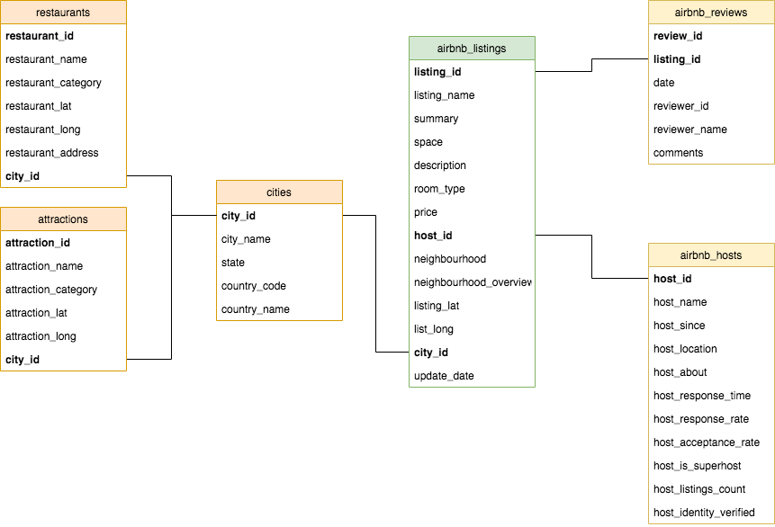

# Eurotour Data Warehouse

This project was scoped as the Capstone Project for the Udacity Data Engineering nanodegree.

## Description

The Eurotour Data Warehouse was developed to be used by a team of Data Scientists and Data Analysts in a company that offers recommendations for holiday acommodation as a service. 

The idea is: a client would register and answer questions about their holiday preferences, and would get suggestions of acommodations in one or more city. The service would already show which restaurants and leisure options can be found on the surroundings of each option.

This project has a proof of concept of the ETL pipeline used to create and maintain the data warehouse and its data model was designed to generate insights for the recommendation system and to support its development. Some examples are:
- Sentiment analysis: Airbnb reviews, listing descriptions and neighbourhood overviews can be used to train the recommendation system 
- Segmentation analysis of listings across cities: are there differences in terms of price, quality, size that might justify different tourism behaviors?
- Geo data (latitude and longitude) will be used to query the closest restaurants and tourist attractions to each Airbnb listing
- Business insights questions: 
  - What are the neighbourhoods with more Airbnb listings? Do they match the neighbourhoods with more touristic attractions?
  - What are the best Airbnb listings according to user reviews in each city? Is there evidence of difference in price between them and the average? Is there a difference in the response time and rate between these hosts and the average?

### Data Sources

For this project I used two data sources with information of airbnb listings, restaurants and attractions in 2 european cities: Amsterdam and Paris.

1. Inside Airbnb - Adding data to the debate http://insideairbnb.com/get-the-data.html

Inside Airbnb is an independent, non-commercial set of tools and dataset with detailed, public information about Airbnb listings around the world. 

For each of the cities, I collected two `csv` files: `listings` and `reviews`. In total, they contain approximately 3 million reviews for almost 300 thousand Airbnb listings.

2. TourPedia http://tour-pedia.org/about/datasets.html

Tourpedia is a Wikipedia of Tourism. It contains information about accommodations, restaurants, points of interest and attractions of different places in Europe.

For each of the cities, I collected two `json` files: `restaurants` and `attractions`. In total, they contain around 30 thousand restaurants and almost 8 thousand attractions.

Note: On the website, the datasets are available in `csv`, but to meet the project specifications they were converted to `json`.

## Architecture

### Data Model

The DWH consists of 6 tables in normal form such that it avoids redundancy and favours data integrity.



You can check the dictionary of the variables in each table here: [data_dictionary.pdf](docs/data_dictionary.pdf)

### DWH technology

Amazon Redshift is chosen as staging environment and as cloud Data Warehouse for three reasons: 
- It can handle all the data transformations required to process raw data into the desired data model and it is highly scalable
- It's convenient for high volumes of data, as one can add and remove cluster nodes according to the needs with an accessible price
- It can be easily queried with industry-standard SQL (Postgres)

### ETL

The ETL pipeline developed for this project is a proof of concept and was written for now of 3 Python scripts:

  * `sql_queries.py` - Collection of SQL queries to drop, create and insert records into the staging tables and DWH databases
  * `create_tables.py` - Sequential commands to create staging tables and DWH tables
  * `etl.py` - ETL processes that extract raw data from s3, loads into staging tables on Redshift and loads relevant data into the 6 DWH tables (described on the Data Model section)

#### How to execute it
Download or clone this repository and make sure you run the following commands from inside your local directory where you saved it.

1. Add your AWS key and secret to `dwh.cfg`

2. Make sure you have an active Redshift cluster and update all the info related to it on `dwh.cfg`

3. Create the Eurotour DWH tables:

```python
python create_tables.py
```

4. Extract data from s3, stage into Redshift and load it into the Eurotour DWH tables:

```python
python etl.py
```

## Addressing other scenarios

1. If the data was increased by 100x

We could add more cluster nodes and assess if the data model can be optimized.

2. If the pipelines would be run on a daily basis by 7 am every day

Assuming that the new data would be already on s3, the ETL should be rewritten as an Airflow dag that would be scheduled to run everyday at 7am.

3. If the database needed to be accessed by 100+ people

Redshift would not have a problem if 100+ people had to access the database, we would just have to scale up/down the cluster nodes accordingly. 

Once there's a better understanding of queries and use cases of the data warehouse, the data model, including sort and dist keys can be adapted to make the access more efficient to each user.
